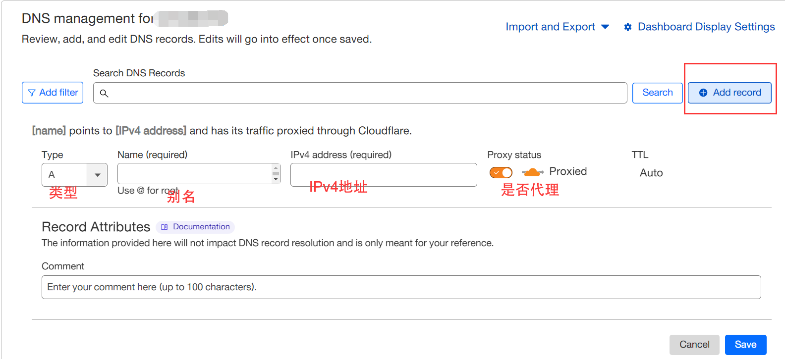

<!-- more -->

> 本文转载自：[使用 cf 拯救被墙的服务器](https://v2xtls.org/v2ray%e4%bd%bf%e7%94%a8cloudflare%e4%b8%ad%e8%bd%ac%e6%b5%81%e9%87%8f%ef%bc%8c%e6%8b%af%e6%95%91%e8%a2%ab%e5%a2%99ip/), 如文中内容有错误请到原文查看

## 第一步：注册：Cloudflare 账号

1. **如果已有账号直接跳到第二步**。打开 [https://www.cloudflare.com/](https://www.cloudflare.com/)，点击右上角的 “Sign up”，填入你的电子邮箱，设置好账户密码(至少 8 位，必须包含数字和特殊字符)，点击“create account”；

2. 界面跳转到添加网站界面，输入你的域名，例如 hijk.pw，注意没有前面的 www。然后点击 “add site”；

3. 界面进入选择套餐界面，点最下面的“free”，然后点"continue"

4. 接下来 CF 会扫描你域名的解析记录，扫描完成后大部分记录都给你设置好了。接着点击“continue”；

5. 界面进入更改 NS 解析服务器提示页面，记住类似下图中的两行 dns 记录：

这一步到此结束，不要关闭 Cloudflare 的网页

## 第二步：更改 DNS 解析服务器

这一步以 Namesilo 为例，讲解将域名的 dns 转移到 cloudflare 的过程，其他域名注册商的域名，请参考官方网站。

1. 打开 [https://www.namesilo.com/](https://www.namesilo.com/), 点击“login”，输入用户名和密码，点击“submit”登录

2. 点击“My Account”, 点击左侧“Domain Manager”，进入域名列表:

3. 勾选域名，然后点击上方的“Change Nameservers”：

4. 进入填写 dns 服务器界面，把默认的三个删掉，在第一栏和第二栏填上 cloudflare 界面上出现的两个域名，例如：`paris.ns.cloudflare.com` 和 `razvan.ns.cloudflare.com`

5. 确认无误后，点击"submit"按钮提交，更改就完成了。

## 第三步：回到 Cloudflare 确认信息。

1. 回到 cloudflare 网页上，点击”done, check nameservers”按钮，“Quick Start Guide”点击下一步即可。

2. 点击左侧“DNS”, 再点击右侧“add record”：

即使记录已经存在，也可以随时修改别名和开关 cf 中转

## 其他

1. dns 解析迁移到 cloudflare，并且设置了经过 cloudflare 的代理（记录上有一朵黄色的云），ping 伪装域名出现的是 cloudflare 的 ip，而不是你的服务器 ip；

2. 在 cf 上添加新的解析记录，默认是代理/中转状态。如果你需要获取 let’s encrypt 证书，可以先禁用代理（点一下那朵云变成灰色），获取完证书再启用中转；

3. Namesilo 刷新记录比较慢，如果 cloudflare 提示 DNS 解析未改过来，多等一会。
